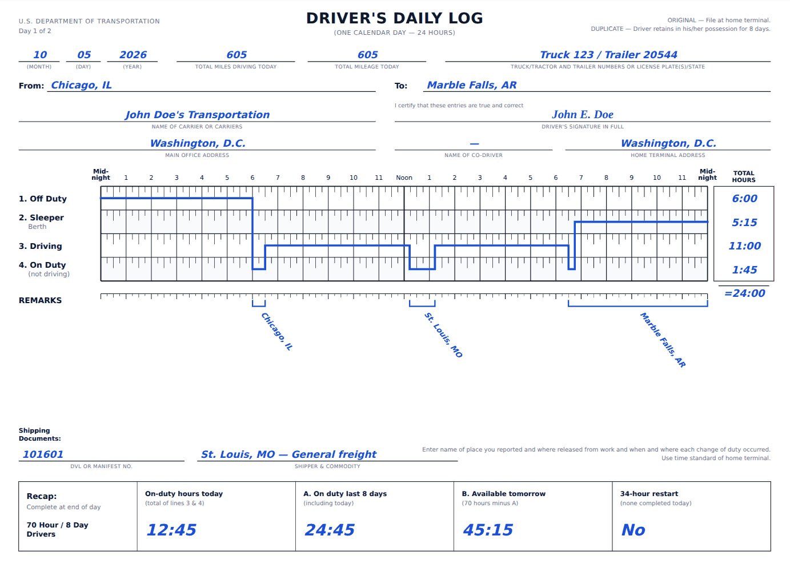

# ELD Trip Planner

Plan a truck trip under the FMCSA hours-of-service rules. Enter the driver's current location, the
pickup, the drop-off and the hours already used in the 70-hour cycle; the app routes the truck,
schedules every legally required break, rest, fuel stop and restart, and fills out a
**driver's daily log sheet for each day** of the trip.

**Live demo:** _add your Vercel URL here_ · **Stack:** Django 5.2 + Django REST Framework · React 19 + TypeScript · MapLibre GL · Tailwind CSS

---

## What it does

| Input | Output |
| --- | --- |
| Current location, pickup, drop-off (autocomplete or free text) | Route map: leg to pickup, loaded leg, a marker for every stop and rest |
| Current cycle used (hours) | Stop-by-stop itinerary with times, durations and locations |
| Departure time (defaults to now) | One FMCSA-style daily log per calendar day: duty-status grid, totals that sum to 24:00, remarks with city/state at every status change, recap |
| Optional: stop durations, inspections, carrier/vehicle details for the log header | Turn-by-turn directions, plus an independent HOS compliance audit of the finished plan |

Plans are shareable: the inputs are written to the URL, and opening the link re-plans the trip.
Logs print one sheet per page (landscape) or save as PDF.


<sub>Day 1 of the Chicago → St. Louis → Dallas example, rendered with the offline routing
fallback (live routing places the overnight stop on the actual interstate).</sub>

## How the hours-of-service rules are applied

The engine (`backend/trips/hos/`) is an event-driven simulation that keeps time in integer
minutes, so every limit is compared exactly. Before each stretch of driving it computes how long
the driver may legally continue and stops just before the first limit that would be broken:

| Rule (property-carrying, 70 h / 8 days) | Source | What the planner does |
| --- | --- | --- |
| 11 hours of driving after 10 consecutive hours off | 49 CFR 395.3(a)(3) | Ends the shift and takes a 10-hour rest (sleeper berth) |
| No driving after the 14th hour since coming on duty | 395.3(a)(2) | Same; off-duty time does not extend the window |
| 30-minute break after 8 cumulative hours of driving | 395.3(a)(3)(ii) | 30 min off duty. Any 30+ consecutive minutes not driving (pickup, fueling) also counts, as the FMCSA guide states |
| 70 hours on duty in any 8 consecutive days | 395.3(b) | When the cycle runs out, takes a 34-hour restart (395.3(c)), which resets it to zero |
| Fuel at least every 1,000 miles | Assessment | 30-min on-duty fuel stop placed at or before the 1,000-mile mark |
| 1 hour for pickup and for drop-off | Assessment | On duty, not driving |

Decisions worth knowing about:

- **Restarts happen early when that delivers sooner.** When the 70-hour cycle won't cover the
  rest of the trip, every 10-hour rest is also a chance to take the 34-hour restart instead. The
  planner simulates both branches and keeps the earlier delivery, so it never spends a 10-hour
  rest just to drive 30 more minutes before a restart anyway. A randomized test asserts that it
  is never slower than the greedy choice.
- **Fuel stops double as breaks.** When a 30-minute break comes due past half a tank and another
  fill-up is needed before arrival, the driver fuels during the break instead of stopping twice.
- **Only driving is limited.** On-duty work after the 14th hour or past 70 hours is legal (FMCSA
  guide, pp. 9–11), so a late pickup is allowed. The planner still reserves the post-trip
  inspection inside both limits so that a normal shift ends cleanly.
- **The 11- and 14-hour limits apply per duty period, not per calendar day.** One sheet can show
  more than 11 hours of driving across two duty periods. The audit explains this.
- **Independent audit.** `hos/validator.py` re-derives every clock from the finished timeline
  without sharing the planner's bookkeeping (11 h, 14 h, 8 h/30 min, 70 h, fuel interval, stops,
  continuity). The UI shows the result, and the test suite runs it against 400 randomized trips.

### Assumptions

- Property-carrying driver on the 70-hour/8-day schedule, with no adverse driving conditions and
  no split-sleeper-berth pairing.
- The driver starts rested (10+ hours off). The hours already used stay in the 8-day window for
  the whole trip. This is conservative: the input doesn't say which days those hours fell on, so
  none roll off.
- Each duty day includes a 30-minute pre-trip and a 15-minute post-trip inspection (on duty).
  These are standard practice, follow the Schneider log walkthrough, and are configurable;
  set them to 0 to drop them.
- 10-hour rests are logged on the sleeper-berth line; 34-hour restarts and 30-minute breaks are
  logged off duty.
- Times are home-terminal time (395.8), counted from the departure entered. No time-zone
  shifting is applied mid-trip.

## Architecture

```
frontend/  React + TypeScript (Vite)                  backend/  Django + DRF (stateless, no database)
  TripForm ── POST /api/trips/plan ─────────────────▶   views.PlanTripView
  LocationInput ── GET /api/geocode?q= ─────────────▶   services/geocoding.py  ─▶ Photon (OSM), offline fallback
  RouteMap (MapLibre + OpenFreeMap tiles)               services/routing.py    ─▶ OSRM demo → FOSSGIS mirror → estimate
  Itinerary · Directions · Compliance                   services/trip_planner.py  orchestration + JSON
  LogSheet (SVG, FMCSA form layout)                     hos/planner.py         HOS simulation
                                                        hos/validator.py       independent audit
                                                        hos/daily_logs.py      midnight-to-midnight sheets
                                                        services/places.py     33.5k-town offline index for remarks
```

- **Routing**: OSRM (keyless) on OpenStreetMap. The public profile is a car profile, so each step
  is slowed to at most 65 mph, a typical governed truck speed. If both OSRM servers fail, the
  plan falls back to a clearly flagged straight-line estimate instead of an error. If you set
  `ORS_API_KEY`, OpenRouteService's heavy-goods-vehicle profile is used instead.
- **Remarks**: FMCSA wants the city/town and state at every change of duty status. Stops are
  labelled from a bundled GeoNames index (33,532 US/Canada/Mexico towns, 685 KB) rather than a
  rate-limited reverse geocoder. The labels read like a driver's log, e.g.
  `I-44, 10 mi S of Doolittle, MO`.
- **Stateless API**: a plan is a pure function of its inputs, so there is no database. Shareable
  links carry the inputs, and identical requests hit a route cache.

## API

`POST /api/trips/plan`

```json
{
  "current_location": { "label": "Chicago, IL", "lat": 41.8781, "lon": -87.6298 },
  "pickup_location":  { "label": "St. Louis, MO" },
  "dropoff_location": { "label": "Dallas, TX" },
  "current_cycle_used": 12,
  "departure": "2026-10-05T06:00",
  "options": { "pickup_minutes": 60, "dropoff_minutes": 60, "fuel_interval_miles": 1000,
               "fuel_minutes": 30, "pre_trip_minutes": 30, "post_trip_minutes": 15,
               "rest_in_sleeper": true }
}
```

Coordinates are optional; labels without them are geocoded. `departure` and `options` are
optional. The response contains `route` (legs, geometry, steps), `summary`, `timeline` (every
duty-status segment), `stops`, `daily_logs` (grid lines, totals, remarks, brackets, recap),
`compliance` and `assumptions`. Errors share one shape, `{ "detail", "field", "errors" }`:
400 for validation, 422 when a place can't be found or no road route exists, and 503 when an
upstream map service is down.

Also: `GET /api/geocode?q=` (autocomplete), `GET /api/reverse-geocode?lat=&lon=`, `GET /api/health`.

## Run locally

```bash
# API: http://127.0.0.1:8000
cd backend
python3.12 -m venv .venv && source .venv/bin/activate
pip install -r requirements-dev.txt
python manage.py runserver

# Frontend: http://localhost:5173 (proxies /api to :8000)
cd frontend
npm install
npm run dev
```

Offline development (no routing or geocoding network calls):
`ROUTING_PROVIDER=estimate GEOCODER=offline python manage.py runserver`.

Tests:

```bash
cd backend && pytest          # 479 tests: HOS engine, 400 randomized trips, services, API
cd frontend && npm test       # formatting and shareable-URL round trips
cd frontend && npm run build  # type-check + production build
```

## Deploy

One Vercel project serves both apps: the Vite frontend at `/` and Django at `/api/*`, through
Vercel Services (see `vercel.json`). Step-by-step instructions and a fallback using two separate
projects are in [docs/DEPLOYMENT.md](docs/DEPLOYMENT.md).

| Variable | Default | Purpose |
| --- | --- | --- |
| `DJANGO_SECRET_KEY` | dev key | Set any long random string in production |
| `DJANGO_DEBUG` | `0` | `1` for local debugging only |
| `DJANGO_ALLOWED_HOSTS` | `localhost,127.0.0.1,.vercel.app` | Add a custom domain here (Vercel's own URLs are added automatically) |
| `ROUTING_PROVIDER` | `osrm` | `ors` (truck profile, needs `ORS_API_KEY`) or `estimate` (offline) |
| `ORS_API_KEY` | — | Free key from openrouteservice.org |
| `TRUCK_MAX_SPEED_MPH` | `65` | Speed cap applied to OSRM's car-profile timings |
| `GEOCODER` | `photon` | `offline` uses only the bundled places index |
| `VITE_API_BASE_URL` | same origin | Only for a separately deployed API |

## Known limitations

- Rests and fuel stops are placed where the clock runs out along the route, not snapped to real
  truck stops.
- The split-sleeper-berth provision (7/3, 8/2) is supported by the rules but not used to optimize
  the schedule.
- The public OSRM server is a shared demo with no truck restrictions (low bridges, hazmat). Use
  the ORS truck profile for those.
- Without a per-day breakdown of the prior 7 days, prior cycle hours never roll off (see
  Assumptions).

## Credits

Road data © OpenStreetMap contributors (ODbL). Routing by OSRM, geocoding by Photon (komoot),
tiles by OpenFreeMap, town names from GeoNames (CC BY 4.0). Rules follow the FMCSA *Interstate
Truck Driver's Guide to Hours of Service* (April 2022). This is a planning aid, not legal advice.
